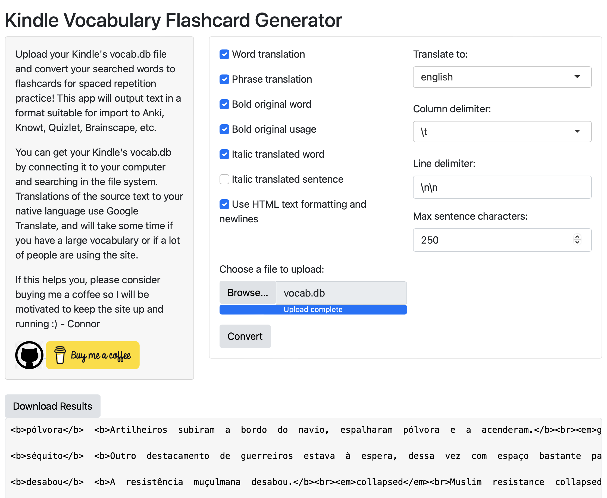
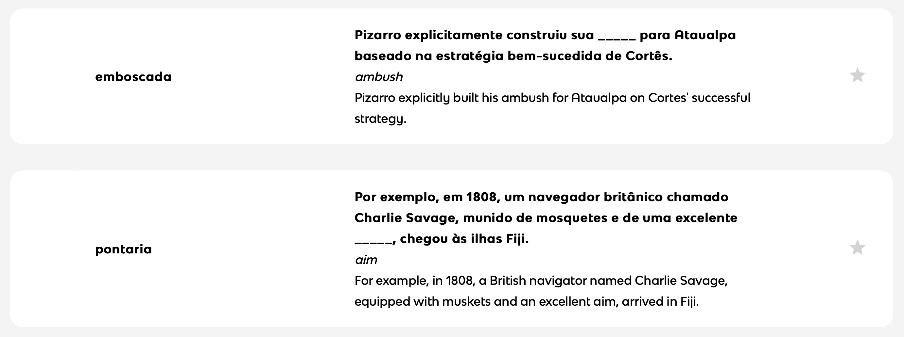

# cardle
A site for generating flash cards from Kindle vocabulary for import to a spaced repetition app.

## Features
- **Read** data directly from a Kindle's `vocab.db` database.
- **Translate** words and their accompanying phrases from text to English (or your native language) using the Google Translate API.
- **Format** into fill-in-the-blank style flashcard questions from apps like [Knowt](https://knowt.io), [Brainscape](https://www.brainscape.com/l/dashboard), or [Quizlet](https://www.brainscape.com/l/dashboard). Two example flashcards searched in Portuguese texts are shown below after upload to Knowt:

